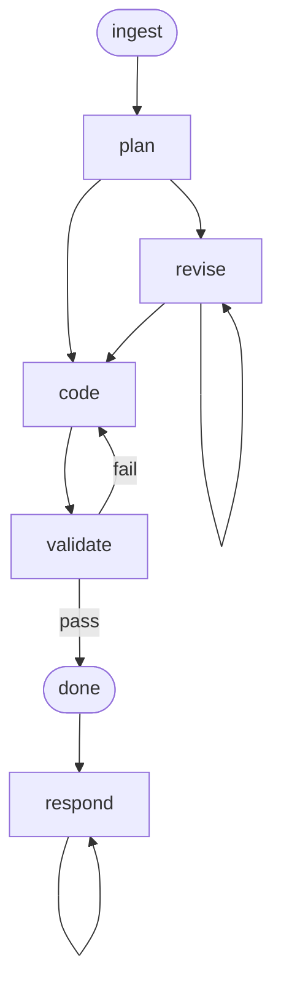

# Implement Workflow

An issue-to-code workflow that takes a GitHub issue from `awslabs/operator-for-ai-chips-on-aws`, plans the implementation, writes contract-based tests and production code via TDD, and runs unit tests to validate. Code changes are left uncommitted for user review.

## Phase Flow



## Prerequisites

| Tool | Required | Purpose |
|------|----------|---------|
| GitHub CLI (`gh`) | For `/ingest` | Fetch GitHub issue details from `awslabs/operator-for-ai-chips-on-aws` |
| Project build/test tooling | Yes | Discovered during `/ingest` from project's AGENTS.md, Makefile, CI workflows |

## Phases

| Phase | Command | Purpose | Artifact(s) |
|-------|---------|---------|-------------|
| Ingest | `/ingest` | Fetch issue, load context, explore codebase | `01-context.md` |
| Plan | `/plan` | Design implementation approach and test strategy | `02-plan.md` |
| Revise | `/revise` | Incorporate feedback into the plan | Updated `02-plan.md` |
| Code | `/code` | Write tests and code via TDD | `03-test-report.md`, `04-impl-report.md` |
| Validate | `/validate` | Run unit tests | `05-validation-report.md` |
| Respond | `/respond` | Address user review comments | `06-review-responses.md` |

## Typical Flow

```text
/ingest 65
  → fetches issue #65 from awslabs/operator-for-ai-chips-on-aws
  → explores affected codebase areas
  → discovers validation profile (build, test, lint commands)
  → writes .artifacts/implement/gh-65/01-context.md

/plan
  → designs implementation approach
  → defines interfaces and types (the contracts)
  → plans test strategy (unit + integration)
  → breaks work into ordered tasks
  → writes 02-plan.md

/revise (optional, repeatable)
  → user reviews plan, requests changes
  → plan updated, consistency maintained

/code
  → for each task: write tests → write code → run tests
  → updates 02-plan.md with task completion status
  → writes 03-test-report.md, 04-impl-report.md
  → changes left uncommitted in working tree

/validate
  → runs unit tests
  → diagnoses and fixes failures
  → writes 05-validation-report.md

/respond (repeatable)
  → user provides review comments on the changes
  → proposes responses and code fixes
  → applies approved changes
  → writes 06-review-responses.md
```

## Artifacts

All artifacts are stored in `.artifacts/implement/{issue-id}/` (e.g., `gh-65`).

```text
.artifacts/implement/gh-65/
  01-context.md              (issue context, validation profile)
  02-plan.md                 (task breakdown, test strategy — updated as tasks complete)
  03-test-report.md          (tests written, contracts covered)
  04-impl-report.md          (changes, deviations)
  05-validation-report.md    (unit test results)
  06-review-responses.md     (review comment log)
```

## Key Design Decisions

### Contract-Based Testing

Tests validate behavioral contracts through public interfaces:
- Every behavioral path reachable through a public function gets its own test case
- Tests should remain valid if the implementation were rewritten
- Unit tests are always required; integration tests are required when the issue touches component interactions
- Coverage tooling is a signal ("is there a behavioral contract I missed?"), not a numeric target. However, new code that cannot reach the project's coverage threshold (discovered during `/ingest`, default 90%) through public API tests signals a design problem — the component likely needs decomposition into smaller units, not tests that reach into internals

### Discovery-Based Validation

The workflow does not hardcode language-specific commands. During `/ingest`, it discovers the project's validation expectations from AGENTS.md, Makefile, and CI workflows, and records them in a validation profile. `/validate` executes whatever was discovered. If the project adds new CI checks, the next `/ingest` picks them up automatically.

### No Git Operations

The workflow does not commit, push, fetch, create branches, or create PRs. It works on whichever branch the working directory is already on and assumes the local directory is aligned with the remote. All code changes across all tasks are left in the working tree (visible via `git status`) for the user to review and manage. No commits are made between tasks. The user is responsible for committing, branching, and creating PRs outside this workflow.

### Plan as Living Document

`02-plan.md` is updated during `/code` as tasks are completed. On re-invocation (e.g., after context limits or interruptions), the plan shows which tasks are done and which remain.

## Directory Structure

```text
implement/
├── SKILL.md                    # Workflow entry point
├── guidelines.md               # Behavioral rules and guardrails
├── README.md                   # This file
├── skills/
│   ├── controller.md           # Phase dispatcher and transitions
│   ├── ingest.md               # Fetch issue, explore codebase
│   ├── plan.md                 # Design implementation approach
│   ├── revise.md               # Incorporate plan feedback
│   ├── code.md                 # Write tests and code via TDD
│   ├── validate.md             # Run unit tests
│   └── respond.md              # Address review comments
└── commands/
    ├── ingest.md               # /ingest command
    ├── plan.md                 # /plan command
    ├── revise.md               # /revise command
    ├── code.md                 # /code command
    ├── validate.md             # /validate command
    └── respond.md              # /respond command
```

## Getting Started

```bash
# Install the workflow
./install.sh claude --workflows implement

# Or install all workflows
./install.sh all
```

Then in your project, run the `implement` workflow's `ingest` command for your GitHub issue number (e.g., `65`).
